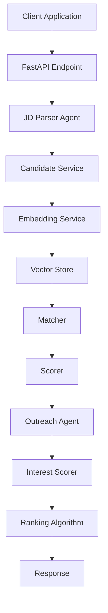
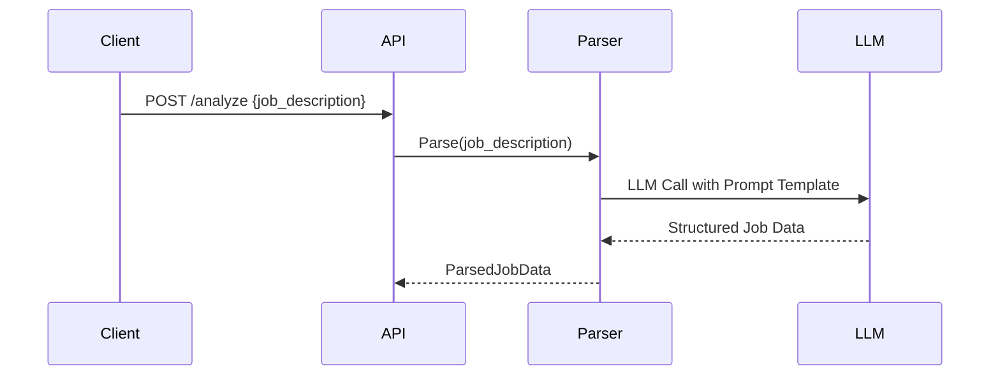
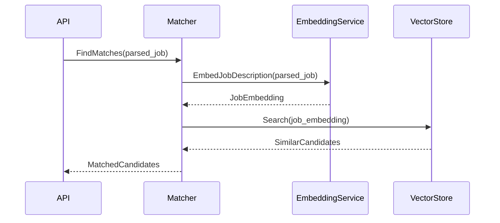
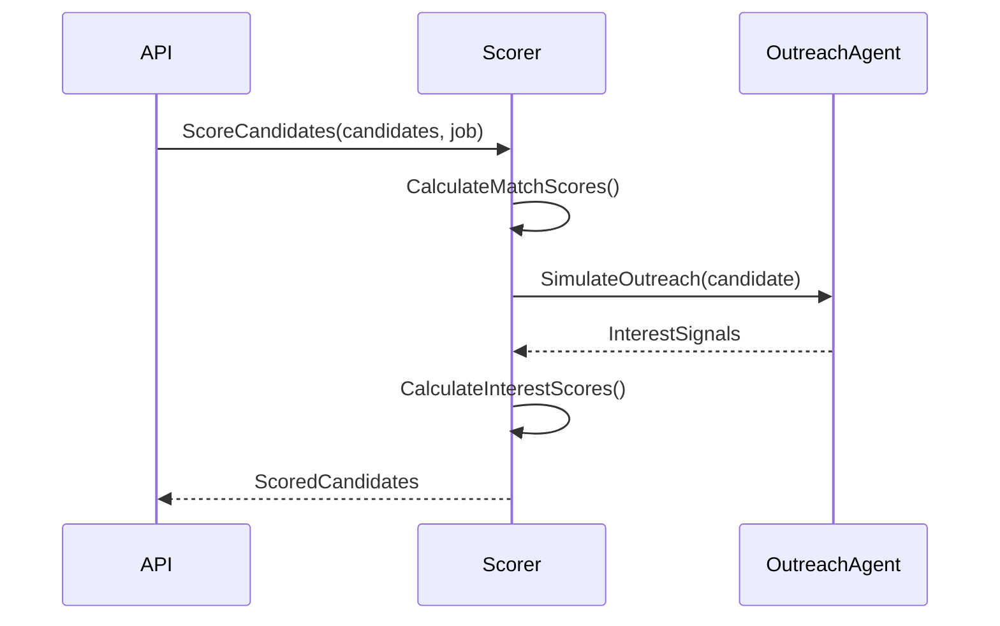

# Design Document for AI-Powered Talent Scouting & Engagement Agent

## Data Models and Schemas

### Job Description Schema
```python
class JobDescription(BaseModel):
    role: str
    skills_required: List[str]
    skills_optional: List[str]
    experience_years: int
    seniority: str
    domain: str
    signals: List[str]
```

### Candidate Schema
```python
class Candidate(BaseModel):
    id: str
    name: str
    skills: List[str]
    years_of_experience: int
    domain: str
    past_roles: List[str]
    activity_signals: Dict[str, bool]  # e.g., {"open_to_work": True, "recently_applied": False}
```

### Match Result Schema
```python
class MatchResult(BaseModel):
    candidate_id: str
    match_score: float  # 0-100
    match_explanation: List[str]
```

### Interest Assessment Schema
```python
class InterestAssessment(BaseModel):
    candidate_id: str
    interest_score: float  # 0-100
    interest_explanation: List[str]
    status: str  # "interested", "not_interested", "unknown"
    engagement_level: str  # "high", "medium", "low"
```

### Final Ranking Schema
```python
class RankedCandidate(BaseModel):
    name: str
    match_score: float
    interest_score: float
    final_score: float
    match_explanation: List[str]
    interest_explanation: List[str]
```

## System Architecture Diagram



## Component Interactions

### 1. JD Parser Agent Workflow


### 2. Candidate Matching Workflow


### 3. Scoring Workflow


## Prompt Engineering Strategy

### JD Parsing Prompt Template
```
You are an expert recruiter specializing in parsing job descriptions. 
Extract the following information from the job description below:

Role: [Main job title]
Skills Required: [List of required skills]
Skills Optional: [List of preferred/nice-to-have skills]
Experience: [Minimum years of experience required]
Seniority: [Seniority level: Junior/Mid-level/Senior/Lead/Executive]
Domain: [Industry domain: Tech/Finance/Healthcare/etc.]
Signals: [Other important signals like remote work, visa sponsorship, etc.]

Job Description:
{{job_description}}

Provide your response in the exact format specified above.
```

### Outreach Simulation Prompt Template
```
You are conducting an initial outreach conversation with a potential job candidate.
Your goal is to assess their interest in the opportunity without being pushy.

Job Role: {{role}}
Company: {{company}}
Location: {{location}}

Conversation History:
{{conversation_history}}

Next message from the candidate. Based on their profile and the job details, 
generate a realistic response that indicates their level of interest.
Consider factors like:
- Alignment with their background
- Career progression opportunities
- Compensation and benefits (if mentioned)
- Location preferences
- Current employment status

Respond in a natural, conversational tone.
```

### Interest Classification Prompt Template
```
Analyze the candidate's response in the conversation below and classify their interest level.

Conversation:
{{conversation_transcript}}

Classify their interest as one of:
- HIGH: Clearly interested and engaged
- MEDIUM: Somewhat interested but with reservations
- LOW: Not interested or lukewarm response
- DECLINE: Explicitly not interested

Also extract key signals about:
- Availability
- Salary expectations
- Relocation willingness
- Other constraints

Provide your response in JSON format:
{
  "interest_level": "HIGH|MEDIUM|LOW|DECLINE",
  "key_signals": ["signal1", "signal2", ...],
  "summary": "Brief summary of their position"
}
```

## Scoring Algorithms

### Match Score Calculation
```
Match Score = (Skills Match × 0.4) + (Experience × 0.2) + (Domain × 0.15) + (Seniority × 0.15) + (Bonus × 0.1)

Where:
- Skills Match: % of required skills possessed by candidate
- Experience: 100 if meets/exceeds requirement, decreasing score for less experience
- Domain: 100 for exact match, partial score for related domains
- Seniority: 100 for exact match, partial score for adjacent levels
- Bonus: Points for additional beneficial characteristics
```

### Interest Score Calculation
```
Interest Score = (Explicit Interest × 0.4) + (Engagement × 0.2) + (Activity Signals × 0.2) + (Responsiveness × 0.2)

Where:
- Explicit Interest: Direct statements of interest
- Engagement: Quality and frequency of responses
- Activity Signals: Indicators like "open to work", recent applications
- Responsiveness: Speed and completeness of responses
```

## Error Handling Strategy

1. **LLM API Failures**: Implement retry logic with exponential backoff
2. **Embedding Generation Failures**: Fall back to keyword matching
3. **Database Connection Issues**: Log errors and return cached results when possible
4. **Invalid Inputs**: Validate all inputs and return descriptive error messages
5. **Rate Limiting**: Queue requests and process when rate limits allow

## Security Considerations

1. **API Key Management**: Secure storage and rotation of API keys
2. **Data Privacy**: Anonymize candidate data where possible
3. **Input Sanitization**: Prevent injection attacks in prompts
4. **Access Control**: Authentication for API endpoints (future enhancement)
5. **Audit Logging**: Track all operations for compliance

## Performance Optimization

1. **Caching**: Cache embeddings and parsed job descriptions
2. **Batch Processing**: Process multiple candidates simultaneously where possible
3. **Asynchronous Operations**: Use async/await for non-blocking operations
4. **Database Indexes**: Optimize queries with proper indexing
5. **Memory Management**: Efficiently manage vector store memory usage